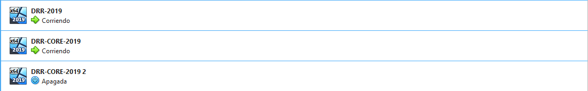
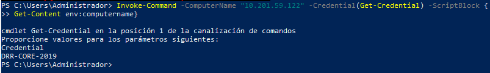

# PR0201: Administración remota con Powershell

## Preparación de las máquinas

### Configuraremos 3 máquinas nuevas, dos sin entorno gráfico, y otra con entorno gráfico.

## Configuración del acceso remoto al nuevo equipo

### Accederemos con las credenciales para comprobar que funciona

## Configuración del acceso remoto sobre HTTPS

### Aseguraremos nuestra red cambiando el protocolo de HTTP a HTTPS. Necesitaremos un certificado autofirmado.

