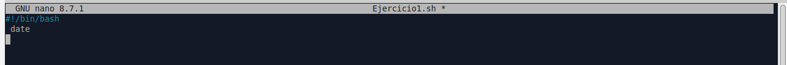
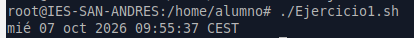
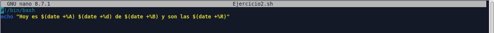
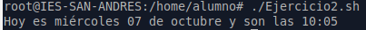
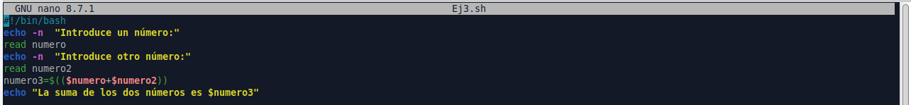
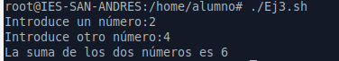
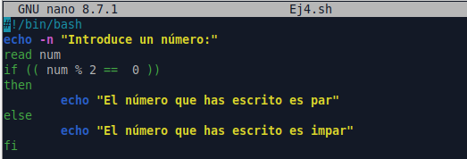
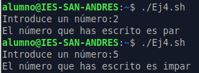

# PR0301: Primeros scripts en Bash

## 1. Crea un script que muestre por pantalla la fecha y la hora del sistema

## 2. Mejora el script anterior para que muestre un mensaje de la forma: “Hoy es jueves día 15 de abril y son las 12:00 horas”. Tendrás que mirar la ayuda del comando date para poder extraer las diferentes partes de la fecha y hora.

## 3. Crea un script que solicite la usuario dos números y luego imprima la suma de esos números

´

## 4. Crea un script que determine si un número introducido por el usuario es par o impar. Para realizar este ejercicio puedes utilizar el operador módulo, que es el símbolo %

## 5. Escribe un script que solicite el nombre de un archivo y luego imprima cuántas líneas tiene ese archivo. Verifica que el archivo exista antes de contar las líneas.

